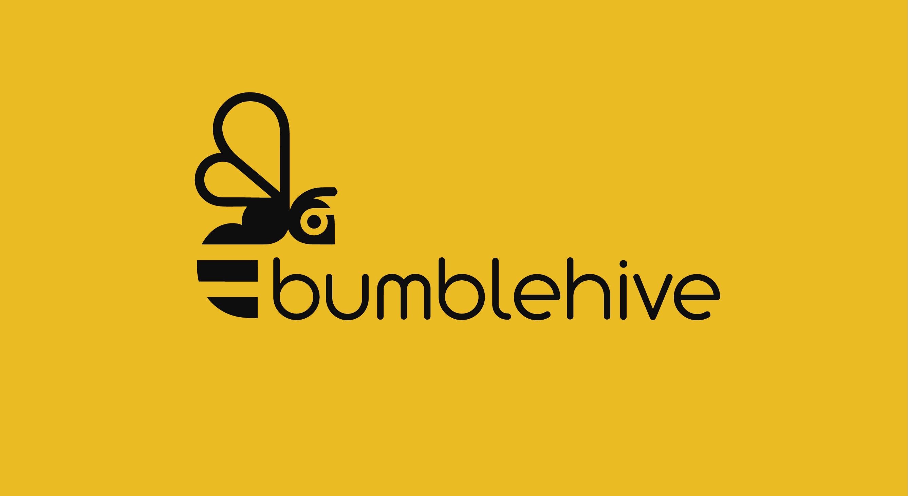

<div align="center">



**小核心，大轰鸣 | Small Core, Big Buzz**

A lightweight Python SDK for building a complete Agent Loop in just a few lines of code.

[](https://pypi.org/project/bumblehive/)
[](https://www.python.org/)
[](https://github.com/wxhcore/bumblehive/actions/workflows/sdk-ci.yml)
[](https://modelcontextprotocol.io/)
[](https://opensource.org/licenses/Apache-2.0)
[](https://linux.do)

English | [简体中文](./README_zh.md)

</div>

---

## Try It in 30 Seconds

Install the Python SDK:

```bash
python -m pip install bumblehive
```

Set `BUMBLEHIVE_MODEL`, `BUMBLEHIVE_API_KEY`, and `BUMBLEHIVE_BASE_URL`, then run:

```python
import asyncio
import os

import bumblehive


async def main() -> None:
    config = bumblehive.RuntimeArguments(
        model=os.environ["BUMBLEHIVE_MODEL"],
        api_key=os.environ["BUMBLEHIVE_API_KEY"],
        base_url=os.environ["BUMBLEHIVE_BASE_URL"],
    )

    async with bumblehive.from_config(config) as runtime:
        await runtime.run_console("Explain Agent Loop in one sentence.")


asyncio.run(main())
```

`run_console()` displays the runtime process and final answer directly in your terminal.

## Choose a Run Method

| API | Best for |
| --- | --- |
| `run_console()` | Trying or debugging an Agent in the terminal |
| `run()` | Getting a structured result for a Python application |
| `stream()` | Consuming runtime events in a custom interface |

## Core Capabilities

- Manage model calls, the Agent Loop, and resource lifecycles through Runtime.
- Give an Agent Python functions, built-in tools, or MCP servers.
- Add streaming events, conversation history, persisted sessions, Skills, and observability hooks when needed.

## Desktop

Bumblehive Desktop is an optional reference application built with the Bumblehive Python SDK. It shows how Runtime, tools, and sessions can be combined into a complete product.

<p align="center">
  
</p>

Desktop installers will be published through [GitHub Releases](https://github.com/wxhcore/bumblehive/releases).

## Next Steps

The English documentation is in progress. See the [English overview](https://wxhcore.github.io/bumblehive/en/), the [complete Chinese documentation](https://wxhcore.github.io/bumblehive/), or the runnable [examples](examples/README.md).

| Goal | Start here |
| --- | --- |
| Make the first Agent call | [First call (Chinese)](https://wxhcore.github.io/bumblehive/getting-started/first-call/) |
| Add a Python tool | [Register a tool (Chinese)](https://wxhcore.github.io/bumblehive/getting-started/first-tool/) |
| Save a conversation | [History and sessions (Chinese)](https://wxhcore.github.io/bumblehive/how-to/memory-and-sessions/) |
| Use Skills or MCP | [Skills and MCP (Chinese)](https://wxhcore.github.io/bumblehive/how-to/skills-and-mcp/) |
| Look up a public API | [API Reference (Chinese)](https://wxhcore.github.io/bumblehive/reference/runtime/) |
| Browse runnable code | [Examples](examples/README.md) |

## Local Development

The Python SDK, Server, and WebUI development workflow supports macOS, Windows, and Ubuntu Linux. It requires Python 3.11+, Node.js 22.12+, and pnpm 10.33.0. A dedicated Conda environment is recommended:

```bash
pnpm run setup
```

`pnpm run setup` is the only project setup entry point. It installs every Node workspace dependency from the root lockfile, then uses the active Python interpreter to install the SDK, Server, test, and desktop packaging dependencies before running the core environment check. `pnpm run dev` repeats that lightweight preflight before starting either process. If a requirement is missing, the command stops with a targeted error. The same command works on Ubuntu Linux and does not require the desktop system toolchain. Set `BUMBLEHIVE_PYTHON` to an interpreter path to override the active interpreter.

For daily development:

```bash
pnpm run dev
```

This starts the Server on `127.0.0.1:18421` and the WebUI on `127.0.0.1:1420`. Use `pnpm run dev:server` or `pnpm run dev:web` to run one component, and `pnpm test` for the Python test suite.

### Desktop

The optional desktop workflow currently targets macOS and Windows. macOS additionally requires Rust and Xcode Command Line Tools. Windows additionally requires the Rust MSVC toolchain, WebView2, and Microsoft C++ Build Tools with the Desktop development with C++ workload.

After the shared `pnpm run setup`, start development or create the installer for the current platform:

```bash
pnpm run dev:desktop
pnpm run build:desktop
```

Both commands verify Rust, Tauri, and the platform toolchain, then automatically package the Python Server as a sidecar before starting Tauri. `build:desktop` creates an app and DMG on macOS or an NSIS installer on Windows.
